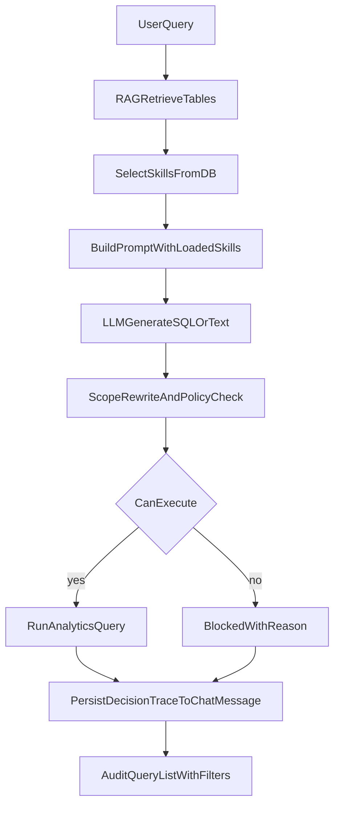

# SQL 技能数据库化与命中可观测计划

## 目标
- 支持运营/产品在后台配置 SQL 技能（名称、描述、内容、关键词、启停、优先级），无需发版。
- 在每次查询中可追踪：命中了哪些技能、哪些策略生效、为何阻断/未执行。
- 不破坏现有 NL→SQL 流程与审计接口，先做增量扩展。

## 现状锚点
- Prompt 构建在 [backend/app/services/rag.py](/Users/qinxiaoyan/work/datepgv/backend/app/services/rag.py)，目前技能来自代码常量服务 [backend/app/services/sql_skill_service.py](/Users/qinxiaoyan/work/datepgv/backend/app/services/sql_skill_service.py)。
- 查询审计来自 [backend/app/services/audit_list.py](/Users/qinxiaoyan/work/datepgv/backend/app/services/audit_list.py) + [backend/app/api/audit.py](/Users/qinxiaoyan/work/datepgv/backend/app/api/audit.py)，当前只能看到 `generated_sql/executed/elapsed_ms`，看不到命中策略细节。
- 聊天消息模型为 [backend/app/models/chat.py](/Users/qinxiaoyan/work/datepgv/backend/app/models/chat.py)，已有 `result_preview` JSONB 可复用或扩展。

## 方案设计
### 1) 技能配置数据模型（DB）
- 新增 `sql_skills` 表（建议字段）：
  - `id, name(unique), description, content, keywords(jsonb), sql_types(jsonb), priority, enabled, updated_by, created_at, updated_at`
- 启动迁移在 [backend/app/core/migrations.py](/Users/qinxiaoyan/work/datepgv/backend/app/core/migrations.py) 中新增幂等建表与索引。
- 首次启动将当前代码内置技能回填到 DB（仅在表为空时），保证平滑切换。

### 2) 技能服务改造（读取 DB + 缓存）
- 在 [backend/app/services/sql_skill_service.py](/Users/qinxiaoyan/work/datepgv/backend/app/services/sql_skill_service.py) 改为：
  - 从 DB 读取已启用技能并按 `priority` 排序；
  - 保留现有选择逻辑（关键词打分）作为基础；
  - 增加短 TTL 内存缓存（例如 30-60s）降低每次 prompt 查库开销；
  - 提供显式 `reload` 能力，供后台变更后立即生效。
- 为兼容期保留“DB 空时回退代码默认技能”开关（短期兜底）。

### 3) 查询链路可观测埋点（核心）
- 在 [backend/app/api/chat.py](/Users/qinxiaoyan/work/datepgv/backend/app/api/chat.py) 的 `chat_stream` 中，记录每轮的“决策轨迹”对象：
  - `selected_skill_names` / `selected_skill_ids`
  - `scope_applied`, `scope_blocked`, `scope_block_reason`, `scope_disallowed_provinces`
  - `sql_generated`, `sql_executed`, `execution_error_category`
- 将上述轨迹写入 `chat_messages`（建议新增 `decision_trace JSONB`，而非挤占 `result_preview`），便于后续检索与过滤。
- 在 `_save_messages` 入参中增加 `decision_trace`，并只写 assistant 消息行。

### 4) 审计接口增强（可查询“命中策略”）
- 扩展 [backend/app/services/audit_list.py](/Users/qinxiaoyan/work/datepgv/backend/app/services/audit_list.py) 的 `list_query_audits` SQL，返回：
  - `selected_skill_names`
  - `scope_block_reason`
  - `execution_error_category`
- 扩展 [backend/app/models/schemas.py](/Users/qinxiaoyan/work/datepgv/backend/app/models/schemas.py) 的 `QueryAuditItem` 响应结构。
- 在 [backend/app/api/audit.py](/Users/qinxiaoyan/work/datepgv/backend/app/api/audit.py) 增加筛选参数（可选）：
  - `skill_name`, `blocked_only`, `executed`

### 5) 后台配置 API（运营可用）
- 新增 `api/sql_skills.py`（挂 admin 权限）：
  - `GET /sql-skills` 列表/筛选
  - `POST /sql-skills` 新建
  - `PATCH /sql-skills/{id}` 更新
  - `POST /sql-skills/{id}/enable|disable`
- 复用现有鉴权模式（参考管理类 API）。

## 数据流（命中可追踪）

## 测试与验收
- 单测：
  - `sql_skill_service`：DB 数据选择、priority 排序、关键词命中、缓存失效。
  - `audit_list`：`decision_trace` 字段解析、过滤条件。
- 集成：
  - 场景1 命中技能并执行成功；
  - 场景2 命中 scope 阻断并可在 `/audit/queries` 查到阻断原因；
  - 场景3 后台禁用某技能后，下一次查询不再命中。
- 验收口径：
  - 管理员能回答“这条 SQL 为什么没执行”；
  - 管理员能看到“命中了哪个技能/策略”；
  - 运营改技能后在约定时效内生效（TTL 内）。

## 风险与控制
- 风险：配置错误导致模型行为波动。
  - 控制：技能启停开关 + 优先级 + 回滚（禁用/恢复旧版本）。
- 风险：多一次查库影响时延。
  - 控制：技能缓存 + 索引 + 只加载启用技能。
- 风险：审计数据膨胀。
  - 控制：`decision_trace` 只存关键字段，不落长文本。