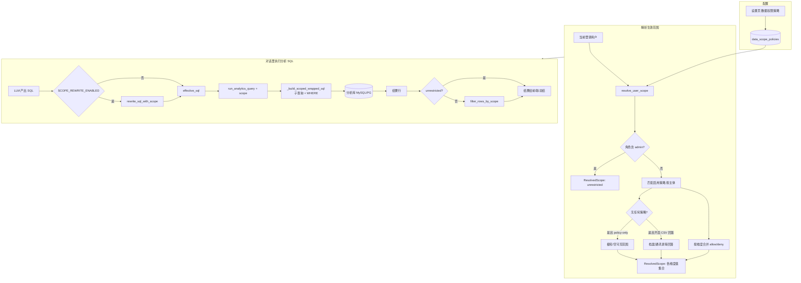

# 数据权限策略流程说明

本文描述当前代码中「数据权限策略」（`data_scope_policies`）从配置到对话执行分析 SQL 的完整路径，与 RAG 的 `rag_chunks` / `/rag/search` 无关。

## 1. 配置（持久化）

- 管理员在 **设置 → 数据权限策略** 维护策略：主体（`subject_type` + `subject_key`）、维度（`dimension`）、允许/拒绝值、合并模式、优先级、是否启用等。
- 数据存储在应用库 PostgreSQL 的 `**data_scope_policies`** 表中。
- 相关 API：`/api/v1/config/scope-policies`（CRUD，管理员）。

## 2. 解析：当前用户 → `ResolvedScope`

- **入口**：`[backend/app/services/scope_policy_service.py](backend/app/services/scope_policy_service.py)` 中的 `resolve_user_scope(current_user, db)`。对话在执行分析 SQL 前会调用。
- **admin 角色**：直接返回 `ResolvedScope(unrestricted=True)`，后续不按策略收窄。
- **非 admin**：用当前用户的 `user_id`、`username`、`employee_level`、**角色名** 等与表中 **启用** 的策略行匹配；按 `priority`、`id` 排序后，将多条策略在各维度（`province` / `employee` / `region` / `district`）上的 allow/deny 做 **union / replace** 合并，得到 `[ResolvedScope](backend/app/services/scope_types.py)`。
- **未命中任何策略**时：
  - 若 `SCOPE_POLICY_CSV_FALLBACK_ENABLED` 为真，可从用户档案/通讯录等做回落（见 `scope_policy_service` 与配置）；
  - 否则在 policy-only 模式下可能得到 **空策略**，执行层表现为几乎无可见数据。

**辅助接口**：`GET /api/v1/config/scope-policies/preview/{user_id}` 用于预览某用户解析后的 scope（调试，不执行 SQL）。

## 3. 对话中的执行路径

在 `[backend/app/api/chat.py](backend/app/api/chat.py)` 中，当对 **PostgreSQL / MySQL** 执行生成 SQL 时，顺序大致为：

1. `**resolve_user_scope`** → 得到 `scope`。
2. **可选 SQL 文本改写**（`SCOPE_REWRITE_ENABLED`，默认见 `[backend/app/core/config.py](backend/app/core/config.py)`）：`[rewrite_sql_with_scope](backend/app/services/sql_scope_guard.py)` 在 SQL 层按省区等约束改写，得到 `effective_sql`。
3. `**run_analytics_query(..., scope=scope)`** → 在 `[query_executor](backend/app/services/query_executor.py)` 中，对非 `unrestricted` 且 `scope` 有约束时，通过 `**_build_scoped_wrapped_sql**` 将查询包成子查询并按探测列加 **WHERE**，在分析库执行。
4. **若 `scope` 仍非 unrestricted**：对返回 **行** 再执行 `[filter_rows_by_scope](backend/app/services/org_hierarchy.py)`，做二次过滤。

## 4. 流程图

## 5. 与 RAG 权限的区别

| 能力   | 数据权限策略                          | RAG ABAC（`UserPermission`） |
| ---- | ------------------------------- | -------------------------- |
| 数据对象 | 分析库执行结果 / 生成 SQL                | `rag_chunks` 向量检索          |
| 典型入口 | `resolve_user_scope` + chat 执行链 | `POST /api/v1/rag/search`  |

业务上「某大区总不能跨区查数」由 **数据权限策略**（及执行链）落实；**不是**由 RAG 层级前缀控制。

## 6. 关键文件索引

| 环节         | 文件                                                                               |
| ---------- | -------------------------------------------------------------------------------- |
| 策略模型       | `backend/app/models/data_scope_policy.py`                                        |
| 解析合并       | `backend/app/services/scope_policy_service.py`                                   |
| SQL 改写     | `backend/app/services/sql_scope_guard.py`                                        |
| 执行包裹 / 行过滤 | `backend/app/services/query_executor.py`、`backend/app/services/org_hierarchy.py` |
| 对话串联       | `backend/app/api/chat.py`                                                        |
| 配置 API     | `backend/app/api/config.py`（scope-policies 路由）                                   |

